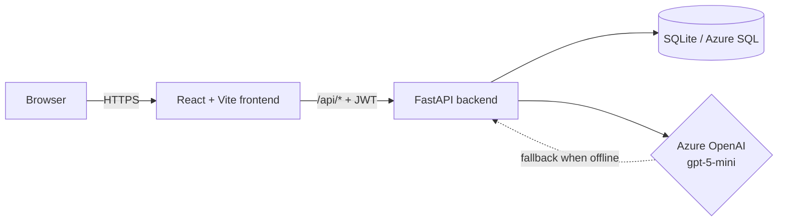
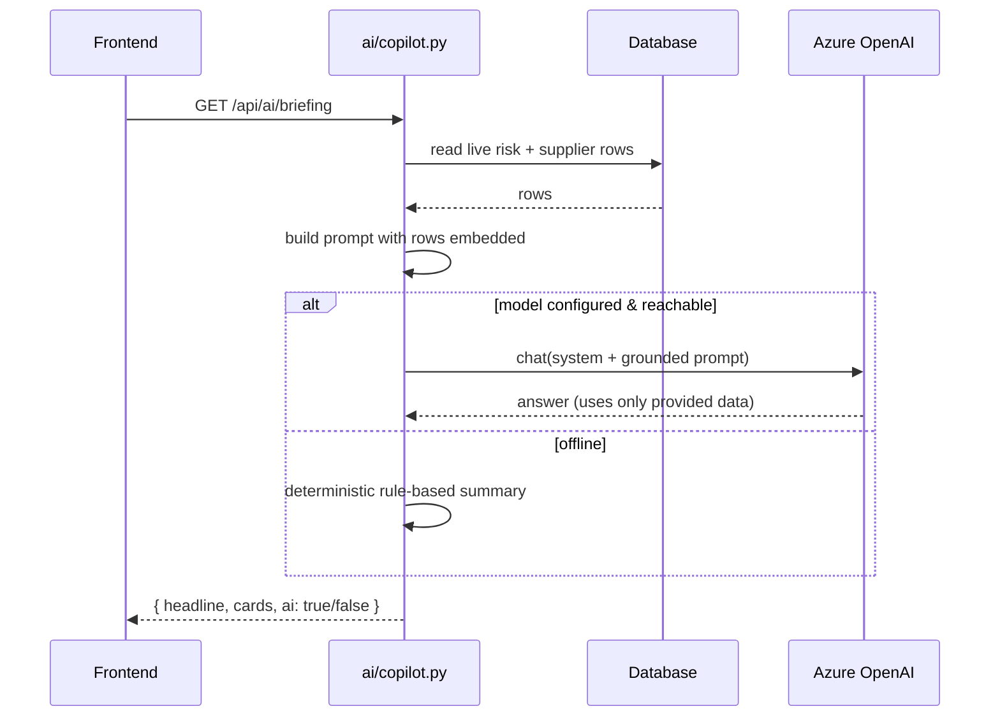

# Architecture

SupplyLens is a two-part application: a **FastAPI** backend that holds the data and
calculation engines, and a **React** frontend that renders the control tower. An
optional **Azure OpenAI** model provides the generative AI layer.

## Backend layout

The backend is organized by domain. Each domain has a **pure engine** (deterministic
math, no database), a **store** (talks to the database), and a **router** (HTTP).

| Folder | Responsibility |
|---|---|
| `main.py` | App entry: middleware (rate limit, CORS), auth wiring, router registration |
| `db.py` | Database abstraction — picks SQLite or Azure SQL by `DB_BACKEND` |
| `database.py` | Risk and supplier read queries |
| `routers/` | One FastAPI router per feature area |
| `decision/` | Action ranking engine + execution (POs, transfers) |
| `inventory/` | 52-week simulation engine, demand forecast, CSV/XLSX import |
| `hedging/` | Commodity hedging engine + price forecast |
| `ai/` | LLM client, copilot (briefing/explain/ask), prompt builder |
| `auth/` | PBKDF2 password hashing + JWT issue/verify |
| `data/` | Seed scripts and CSV import for the database |

### The engine / store / router pattern

Using inventory as an example:

- `inventory/engine.py` — `simulate(part)` takes one part and returns the weekly
  projection. **Pure** — no I/O, fully unit-tested.
- `inventory/store.py` — reads parts from the database, runs the engine, shapes
  the result for the API.
- `routers/inventory.py` — exposes `GET /api/inventory/...` endpoints.

This separation is why the engines have fast, isolated tests and why the same
deterministic logic can serve as the **AI fallback**.

## Frontend layout

| Path | Responsibility |
|---|---|
| `src/main.jsx` | App bootstrap, wraps everything in Auth + Toast providers |
| `src/App.jsx` | Routes and the protected app shell |
| `src/auth.jsx` | Login state, token storage, `useAuth()` |
| `src/api/client.js` | Fetch wrapper — attaches the bearer token, redirects on 401 |
| `src/components/` | Reusable UI (cards, skeletons, toasts, risk chips) |
| `src/pages/` | One component per screen (Today, Dashboard, Hedging, ...) |

## Request lifecycle

1. The user logs in → `POST /api/auth/login` returns a **JWT**.
2. The frontend stores the token and attaches it as `Authorization: Bearer <token>`
   on every request (`src/api/client.js`).
3. The request passes through the **rate-limit** middleware, then **CORS**, then the
   `require_auth` dependency that validates the token and extracts the tenant.
4. The router calls a store, which queries the database via `db.py`.
5. For AI endpoints, the copilot reads live rows, builds a grounded prompt, and
   calls the model — falling back to deterministic logic if the model is offline.

## How the AI is grounded

Key points:
- The model only ever sees data the backend selected; it's instructed to "never
  invent numbers."
- Responses are cached for ~120 seconds to keep the UI fast.
- `reasoning_effort=minimal` keeps latency under ~3 seconds for these short tasks.

## Security

| Layer | Mechanism |
|---|---|
| Authentication | JWT (PyJWT), 12-hour default expiry |
| Passwords | PBKDF2-HMAC-SHA256, 200k rounds (stdlib only) |
| Authorization | All `/api/*` data routes require a valid token; actions are tenant-scoped |
| CORS | Explicit allow-list from `ALLOWED_ORIGINS` (no wildcards in prod) |
| Rate limiting | Per-IP sliding window, default 240 req/min |
| Production guard | App refuses to start with a default `JWT_SECRET` when `ENV=production` |

## Database backends

`db.py` exposes the same `fetch_all` / `fetch_one` / `execute_many` functions
regardless of backend, using `?` placeholders and dialect-aware date helpers
(`months_ago_sql`). Switch with one env var:

- `DB_BACKEND=sqlite` (default) — zero setup, a single `backend/supplylens.db` file.
- `DB_BACKEND=azure` — Azure SQL via `pyodbc` (needs ODBC Driver 18).
</content>
